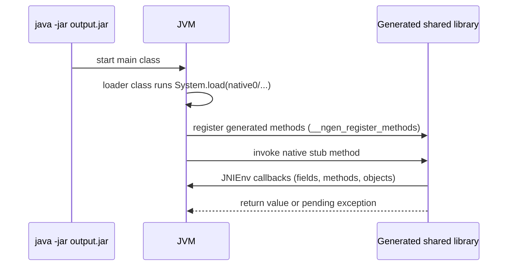
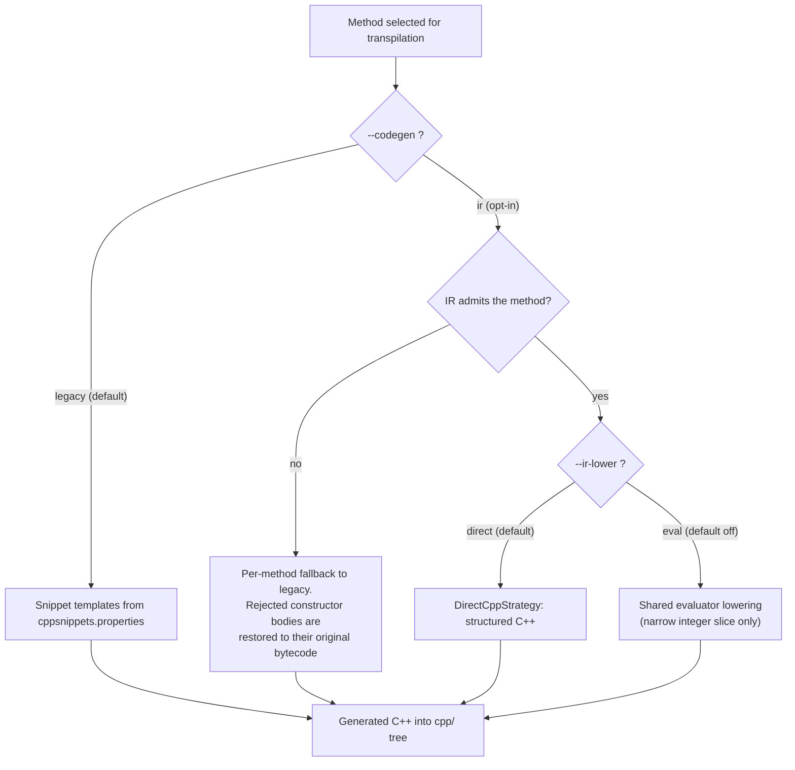

<div align="center">

**English** | [简体中文](README.zh-CN.md)


# native-obfuscator

**Java `.class` to C++ converter for use with JNI.**

[](https://github.com/gaoyu06/native-obfuscator/actions/workflows/main.yml)
[](LICENSE)
[](#current-status)
[](#zig-toolchain)
[](https://github.com/radioegor146/native-obfuscator)

</div>

`native-obfuscator` reads a JAR, transpiles selected method bodies into JNI C++ that reproduces the
bytecode semantics through `JNIEnv`, and replaces those methods with `native` stubs. At runtime the
JVM dispatches into the generated shared library.

The tool still ships a **legacy** snippet-based generator as the CLI default. `master` also includes
an opt-in typed CFG IR path (`--codegen=ir`), a default-off shared IR evaluator lowering
(`--ir-lower=eval`), a default-off in-process interpreter (`--backend=interpreter`), a small
Java-callable C++ SDK, JDK 17+ fixture harnesses, and a benchmark harness. None of that is a
production-support claim.

> [!IMPORTANT]
> This tool **transpiles** bytecode to native. It does not pack binaries and does not, by itself,
> hide algorithm identity from analysis. Use a blacklist/whitelist — transpiling a whole application
> JAR (for example a game client) is usually the wrong default.

**现状（中文）：** 现行目标是把所有方法体迁到 typed CFG IR，停止字符串拼接生成，直到可以完整废弃 legacy。默认仍是 `--codegen=legacy`、`--ir-lower=direct` 与 `--backend=cpp`。`--codegen=ir` 是可选 typed CFG IR；只有该模式会读取 `--ir-lower`。`--ir-lower=eval` 和 `--backend=interpreter` 都默认关闭；解释器现为 ISA v4（int/long + 引用 + `ATHROW`/异常表），仍无 NEW/调用/字段。C++ SDK 会打进生成 JAR。JDK 17 / 21 / 25 IR 语料分别有过 11/11、6/6、4/4 对齐记录，都只是一台 Linux VM 上的测量，**不能**写成“已支持”对应 JDK。完整中文版见 [README.zh-CN.md](README.zh-CN.md)。

---

## Table of contents

- [How it works](#how-it-works)
- [Current status](#current-status)
- [Codegen modes](#codegen-modes)
- [Quick start](#quick-start)
- [Prerequisites](#prerequisites)
- [Usage](#usage)
  - [Arguments](#arguments)
  - [Platforms](#platforms)
  - [Annotations](#annotations)
  - [Basic flow](#basic-flow)
  - [Native-access on JDK 24+](#native-access-on-jdk-24)
- [Zig toolchain](#zig-toolchain)
- [C++ SDK (generated JARs)](#c-sdk-generated-jars)
- [Repository layout](#repository-layout)
- [IR compiler internals](#ir-compiler-internals)
- [Building and tests](#building-and-tests)
- [Documentation](#documentation)
- [Contributing](#contributing)
- [Issues](#issues)

---

## How it works


1. **Load + filter** — `NativeObfuscator.process` streams the JAR, parses classes with ASM into
   `ClassNode`s, and applies `ClassMethodFilter` (blacklist/whitelist plus `@Native`/`@NotNative`).
2. **Bytecode preprocessing** — `IndyPreprocessor` and `LdcPreprocessor` lower `invokedynamic` and
   handle/type constants; the class is re-serialized with `COMPUTE_MAXS | COMPUTE_FRAMES` so frames
   are authoritative before codegen.
3. **Per-method codegen** — `NativeObfuscator`'s method loop is the dispatch point. Each selected
   method goes to the legacy snippet generator (`MethodProcessor`, default), the typed CFG IR path
   (`IrMethodCompiler` when `--codegen=ir`), or the in-process interpreter (`InterpreterMethodEmitter`
   when `--backend=interpreter`, default off). `--ir-lower=eval` is a lowering *inside* the IR
   compiler (`InterpreterStreamStrategy`); it is not the interpreter backend.
4. **Class assembly** — `ClassSourceBuilder`, `CMakeFilesBuilder`, `MainSourceBuilder`, and
   `StringPool` write the `cpp/` tree and rewrite the selected methods into `native` stubs.
5. **Runtime helpers** — `native_jvm.{cpp,hpp}` and `string_pool.{cpp,hpp}` are copied alongside the
   generated sources.
6. **Native build** — CMake, or Zig when `--use-zig` is set. This is a **separate step**; the tool
   does not compile binaries by itself in the default flow.

At runtime, the loader class loads the shared library and the JVM dispatches the `native` stubs into
it over JNI:



A longer visual walkthrough lives in
[`docs/architecture/overview.md`](docs/architecture/overview.md).

## Current status

Recorded on `master` after
[#118](https://github.com/gaoyu06/native-obfuscator/pull/118)/[#119](https://github.com/gaoyu06/native-obfuscator/pull/119)
and the follow-up landings through
[#446](https://github.com/gaoyu06/native-obfuscator/pull/446). Active goal:
[`docs/architecture/current-goal.md`](docs/architecture/current-goal.md). Status detail:
[`docs/architecture/project-status.md`](docs/architecture/project-status.md).

| Topic | What is true |
| --- | --- |
| Active goal | Move all method-body codegen onto IR, then delete the legacy snippet path. Not done. Default stays `legacy` until coverage |
| Default generator | `legacy` (snippet / `cppsnippets.properties`) |
| Opt-in IR | `--codegen=ir` — typed CFG through phase 20 plus `LCMP`, `IF_ACMP*`, monitors / synchronized, preprocessor-lowerable `invokedynamic`, proven `ConstantDynamic` (class and interface), raw MethodHandle / MethodType `LDC`, primitive `Class` `LDC`, and well-formed `jsr`/`ret` inlining. Per-method fallback to legacy when a construct is unsupported |
| Classfile metadata | Input major versions are preserved (Java 8 floor only). Nest / record / sealed attributes are no longer wiped by forcing version 52 |
| Java baseline | Historical README claim remains: **Java 8 is the only version this project has ever called fully supported.** 9+ and Android stay experimental |
| JDK 17 IR fixtures | 11 `--release 17` programs matched HotSpot stdout on **one** Linux x86-64 VM under `--codegen=ir`. That is not a product “supports JDK 17” badge |
| JDK 21 IR fixtures | 6 `--release 21` programs matched on **one** Linux VM after the local-type split. Not “supports JDK 21” |
| JDK 25 IR fixtures | 4 `--release 25` programs matched on **one** Linux VM (Temurin 25.0.4.1+1). 20/21 IR; one hybrid constructor left in Java; JEP 472 warning on every transformed run. Not “supports JDK 25” |
| ClassicTest IR admission | 108/108 methods admitted on the phase-18 corpus (admission ≠ behavioral E2E) |
| Native-access packaging | Output JARs emit `Enable-Native-Access: ALL-UNNAMED` (`java -jar`). Classpath still needs `--enable-native-access=ALL-UNNAMED`. Not “supports JDK 25” |
| C++ SDK | `NativePrimitives` + `NativeStrings` in generated JARs. Not a shipped standalone product SDK |
| Interpreter | `--backend=interpreter` default off (`cpp`). ISA v4: static `int`/`long` plus references and a first exception table (`ATHROW`). No `NEW`, invoke, or fields. Not a protection product |
| Shared evaluator | `--ir-lower=eval` is default off (`direct`) and applies only to successfully built IR methods in its narrow integer slice. Not ship-ready |
| Reader / analysis bar | Unmet. Live IR and opcode artifacts were recovered by unaided readers in the recorded evals |
| Performance | Latest three-mode run: [`docs/benchmarks/results-ir-vs-legacy-phase19.md`](docs/benchmarks/results-ir-vs-legacy-phase19.md). All three kernels stayed on IR on one VM. Not a portable speedup. Prefer a whitelist |

## Codegen modes


How the flags interact for each selected method:



`--backend=interpreter` is a separate, default-off switch (`--backend=cpp` is the default): a narrow
in-process interpreter at ISA v4 (static `int`/`long`, references, `ATHROW`/exception table; no
`NEW`, invokes, or fields). It is not a protection product.

## Quick start


```bash
# 1. Transpile (optionally add --codegen=ir)
java -jar native-obfuscator.jar app.jar out/

# 2. Compile the generated C++ (recorded IR builds used CC=gcc CXX=g++)
cd out/cpp && cmake . && cmake --build . --config Release

# 3. Copy the shared library from build/libs/ into the loader dir printed on stdout (native0/)

# 4. Run
java -jar out/app.jar
```

Or replace steps 2–3 with the built-in [Zig toolchain](#zig-toolchain) (`--use-zig`).

## Prerequisites

1. **JDK** — JDK 8 is enough for the historical path. The current test/E2E work was also run with
   newer JDKs (for example 21) as the *host* compiler. You still need a JDK with `jni.h` when
   compiling generated C++.
2. **CMake** — [cmake.org](https://cmake.org/download/) or your distro package.
3. **C/C++ toolchain** — MSVC or MinGW on Windows; `g++` on Linux/macOS. Default Clang in some
   environments cannot link `libstdc++`; the recorded IR E2E used `CC=gcc CXX=g++`.
4. Optional: **Zig** for `--use-zig` (see below).
5. Optional for the full test suite: [Krakatau](https://github.com/Storyyeller/Krakatau) (`krak2`)
   on `PATH`.

## Usage

```text
Usage: native-obfuscator [-ahV] [--debug] [--codegen=<mode>]
                         [--ir-lower=<lowering>] [--backend=<backend>]
                         [-b=<blackListFile>] [--custom-lib-dir=<dir>]
                         [-l=<librariesDirectory>] [-p=<platform>]
                         [--plain-lib-name=<libraryName>] [-w=<whiteListFile>]
                         [--use-zig] [--zig-targets=<targets>]
                         [--zig-path=<file>] [--jdk-home=<file>]
                         [--zig-install-dir=<dir>]
                         <jarFile> <outputDirectory>
```

### Arguments

| Argument | Meaning |
| --- | --- |
| `<jarFile>` | Input JAR |
| `<outputDirectory>` | Where the transformed JAR and `cpp/` tree are written |
| `-l` | Directory of dependent libraries (optional, recommended) |
| `-p` | `hotspot` (default), `std_java`, or `android` |
| `--codegen` | `legacy` (default) or `ir` |
| `--ir-lower` | `direct` (default) or `eval`; consulted only with `--codegen=ir` |
| `--backend` | `cpp` (default) or `interpreter` (narrow int/i64/reference slice; default off) |
| `-a` | Enable `@Native` / `@NotNative` annotation processing |
| `-w` / `-b` | Whitelist / blacklist files |
| `--plain-lib-name` | Library name for `LoaderPlain` when you ship natives separately or for Android |
| `--custom-lib-dir` | Directory inside the JAR for packed libraries (default printed as `native0/` unless overridden) |
| `--debug` | Also write a non-executable debug JAR |
| `--use-zig` | Compile generated C++ with Zig and pack the shared libraries |
| `--zig-targets` | Comma-separated Zig targets (default `host`) |
| `--zig-path` | Zig executable (overrides installed / `PATH`) |
| `--jdk-home` | JDK with `include/jni.h` (defaults to `JAVA_HOME`) |
| `--zig-install-dir` | Where Zig was installed (default `~/.native-obfuscator/zig/`) |

`--codegen=ir` is opt-in. Its `direct` lowering remains the default; `--ir-lower=eval` selects a
narrow shared evaluator lowering. Unsupported methods fall back per-method to the legacy generator,
except rejected `<init>` bodies, which are restored to the original bytecode (including
`invokedynamic`) instead of being left with internal preprocessor markers. `--backend=interpreter`
is separately opt-in and default off.

### Platforms

- `hotspot` — HotSpot internals; works with many existing obfuscators, including some stack-trace
  checks.
- `std_java` — fewer JVM internals; intended to be more portable across JVMs.
- `android` — no `DefineClass` for hidden methods. Stack-based string/name schemes that need those
  hidden methods will not work.

### Annotations

Maven coordinates: `com.github.radioegor146.native-obfuscator:annotations:master-SNAPSHOT`
(add [JitPack](https://jitpack.io)).

- `@Native` — include the class or method
- `@NotNative` — skip a method inside a `@Native` class

Whitelist/blacklist win over annotations.

Format:

```text
<class>
<class>#<method name>#<method descriptor>
mypackage/myotherpackage/Class1
mypackage/myotherpackage/Class1#doSomething!()V
mypackage/myotherpackage/Class1$SubClass#doOther!(I)V
```

Wildcards: `*` is one `/`-separated segment; `**` is any remaining segments.

### Basic flow

1. `java -jar native-obfuscator.jar <input.jar> <output-dir>`
2. Optional IR: add `--codegen=ir` (and optionally `--ir-lower=eval`)
3. `cmake .` in the generated `cpp/` directory (recorded IR builds used `CC=gcc CXX=g++`)
4. `cmake --build . --config Release`
5. Copy the shared library from `build/libs/` into the loader path printed on stdout (`native0/` by
   default), named like:

   ```text
   x64-windows.dll
   x64-linux.so
   x86-windows.dll
   x64-macos.dylib
   arm64-linux.so
   arm64-windows.dll
   ```

6. `java -jar <output.jar>`

Omit `--plain-lib-name` if you want natives packed into the JAR after you copy them into that loader
directory.

### Native-access on JDK 24+

The loader classes call `System.load`/`System.loadLibrary`, which
[JEP 472](https://openjdk.org/jeps/472) makes restricted operations. On JDK 24+ an unenabled call
warns by default, and a future release may turn that into an error. The output JAR is written with
`Enable-Native-Access: ALL-UNNAMED` in `META-INF/MANIFEST.MF`, so a `java -jar <output.jar>` launch
grants native access to the unnamed module without extra flags (any more specific value already
present in the input manifest is preserved). A classpath launch does not honor that manifest
attribute and still needs the flag:

```text
java --enable-native-access=ALL-UNNAMED -cp <output.jar> <main-class>
```

This is a packaging convenience, not a claim that JDK 25 is supported.

## Zig toolchain

Steps 2–5 can be replaced with `--use-zig` (no CMake / no host compiler; cross-compilation is built
in).

```text
java -jar native-obfuscator.jar install-zig [--version <x.y.z>] [--install-dir <path>] [--force]
```

Downloads an official Zig release (SHA-256 verified) into `~/.native-obfuscator/zig/` by default.

```text
java -jar native-obfuscator.jar --use-zig \
     [--zig-targets x64-windows,x64-linux,arm64-linux] \
     [--jdk-home <path-to-jdk>] \
     <input.jar> <output-dir>
```

Known targets include `x64-linux`, `x64-windows`, `x64-macos`, `arm64-linux`, `arm64-windows`,
`arm64-macos`, `x86-linux`, `x86-windows`, `arm32-linux`, and `host`.

## C++ SDK (generated JARs)

Generated JARs can include `by.radioegor146.sdk.NativePrimitives` and `NativeStrings`. This is
**not** a separately versioned product SDK.

Primitives (see [`docs/sdk/v1-status.md`](docs/sdk/v1-status.md)):

- `abiVersion()`
- `sha256(byte[])`
- `hmacSha256(byte[] key, byte[] message)`
- `aes256GcmEncrypt` / `aes256GcmDecrypt` (32-byte key, 12-byte nonce, 16-byte tag; do not reuse a
  nonce with the same key)
- `constantTimeEquals(byte[], byte[])`

Strings: Java-compatible UTF-16 `length`, `hashCode`, and `concat`. Recorded string benches were
**slower than HotSpot**.

## Repository layout


| Path | Role |
| --- | --- |
| `obfuscator/` | The CLI and transpiler (`by.radioegor146.*`, `ir/`, `interpreter/`, `zig/`, runtime sources) |
| `annotations/` | `@Native` / `@NotNative`, consumable via JitPack |
| `sdk/` | `NativePrimitives` / `NativeStrings`, packed into generated JARs |
| `docs/` | Status, design, benchmark, and review documents — start at [`docs/README.md`](docs/README.md) |

## IR compiler internals


The opt-in `--codegen=ir` path builds a typed control-flow graph (`i32`/`i64`/`f32`/`f64`/reference
values) from the preprocessed ASM tree (`AsmToIr`, `CfgBuilder`, with well-formed `jsr`/`ret`
inlined first), lowers it through a strategy (`DirectCppStrategy` by default, or
`InterpreterStreamStrategy` when `--ir-lower=eval`), and emits structured C++ via `IrCppEmitter`.
`--backend=interpreter` is a separate `NativeObfuscator` path (`InterpreterMethodEmitter`), not an
IR-compiler lowering. Methods with unsupported constructs raise `UnsupportedIrConstructException`
and fall back per-method to the legacy generator; rejected `<init>` bodies are restored to their
original bytecode.

Design and status: [`docs/architecture/ir-compiler.md`](docs/architecture/ir-compiler.md) ·
[`docs/architecture/current-goal.md`](docs/architecture/current-goal.md) ·
[`docs/architecture/project-status.md`](docs/architecture/project-status.md).

## Building and tests

```text
./gradlew assemble          # skip tests
./gradlew build             # assemble + full suite (needs krak2 for some cases)
```

Focused IR suite used during the integration:

```text
CC=gcc CXX=g++ ./gradlew :obfuscator:test \
  --tests by.radioegor146.ir.IrCompilerTest \
  --tests by.radioegor146.CodegenModeTest
```

ClassicTest-style fixtures live under `obfuscator/test_data/`. Some of that corpus comes from
[huzpsb/JavaObfuscatorTest](https://github.com/huzpsb/JavaObfuscatorTest).

CI runs the "Main pipeline" workflow
([`.github/workflows/main.yml`](.github/workflows/main.yml)) on JDK 8/11/17/21/25 across
Ubuntu/macOS/Windows.

## Documentation

Start at [`docs/README.md`](docs/README.md).

| Doc | Role |
| --- | --- |
| [Architecture overview](docs/architecture/overview.md) | Visual walkthrough of the pipeline (bilingual) |
| [Current goal](docs/architecture/current-goal.md) | Active goal: IR-complete codegen, then delete legacy |
| [Project status](docs/architecture/project-status.md) | What landed on master, what did not, what must not be claimed |
| [IR compiler](docs/architecture/ir-compiler.md) | Typed CFG design |
| [IR phase 18](docs/architecture/ir-phase18-status.md) | Primitive arrays and `MULTIANEWARRAY` |
| [JDK 17 IR runtime repair](docs/architecture/ir-jdk17-runtime-fix.md) | Version / indy / `invokeExact` |
| [SDK v1](docs/sdk/v1-status.md) | Java API and C ABI |
| [Benchmarks](docs/benchmarks/README.md) | How to run the harness; do not invent numbers |
| [Historical options brief](docs/architecture/goal-status-and-options.md) | Pre-landing maintainer snapshot (now superseded as *current* status) |

## Contributing

See [`CONTRIBUTING.md`](CONTRIBUTING.md). Short version: read
[`docs/architecture/current-goal.md`](docs/architecture/current-goal.md) first, gate changes on
executed tests, and never inflate status claims.

## Issues

Open an issue on this repository, or contact the original author at [re146.dev](https://re146.dev).

## License

[GPL-3.0](LICENSE).

### Stargazers over time

[](https://starchart.cc/radioegor146/native-obfuscator)
