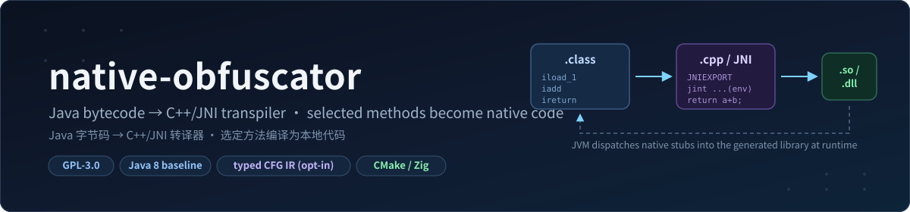
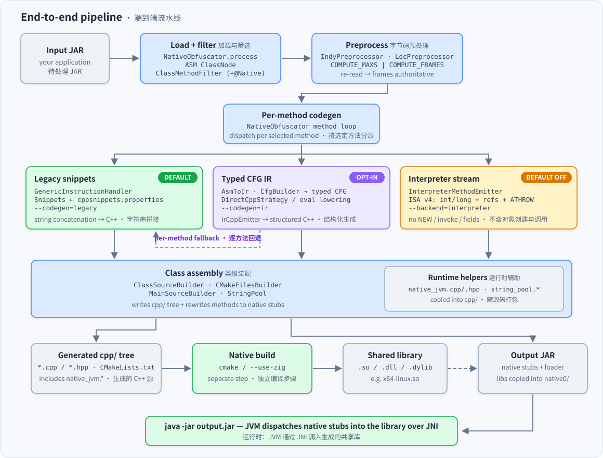
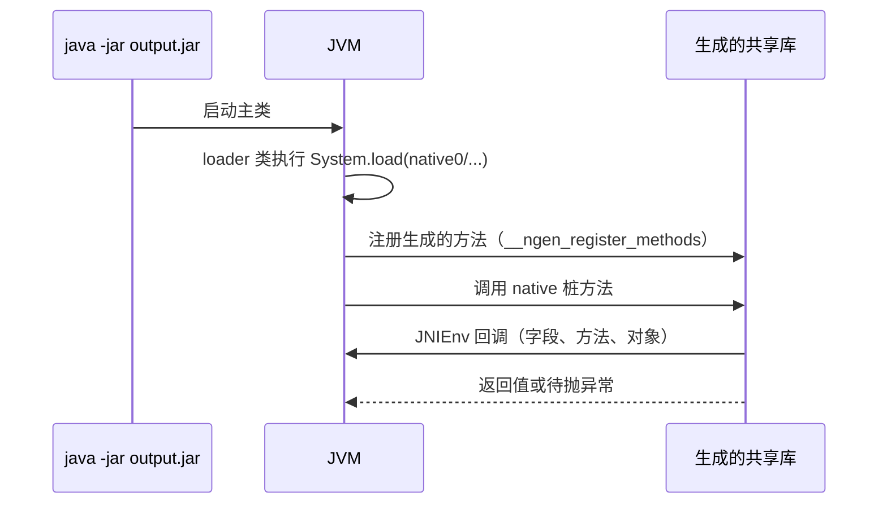
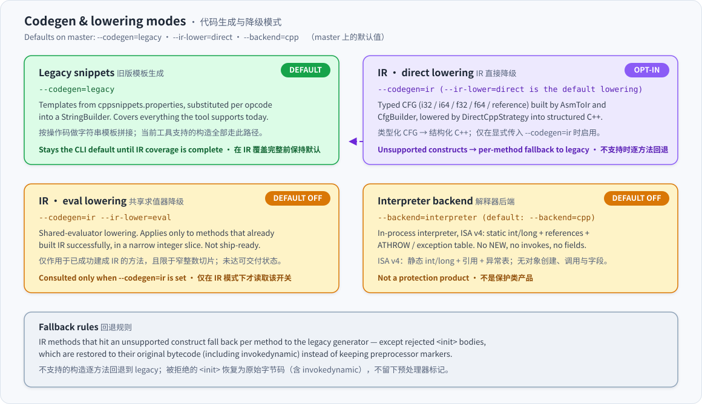
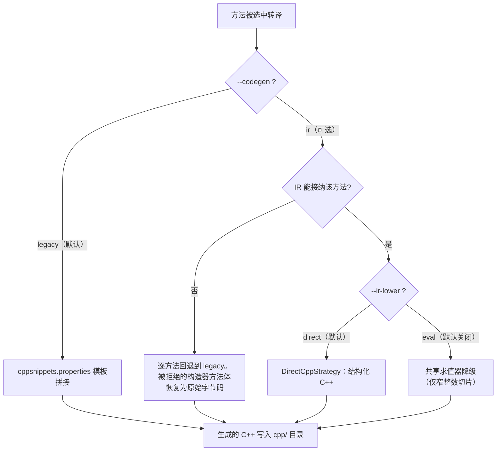
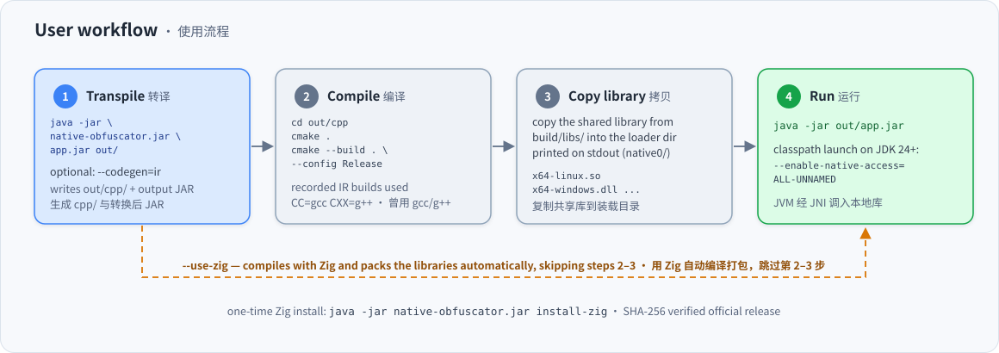
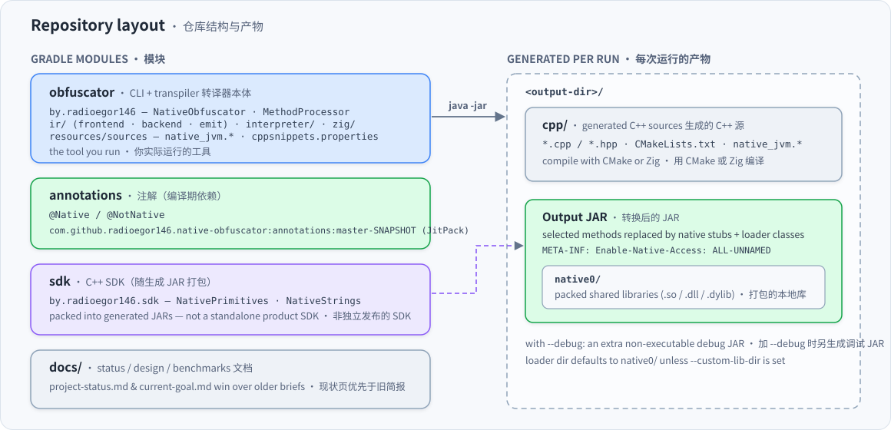
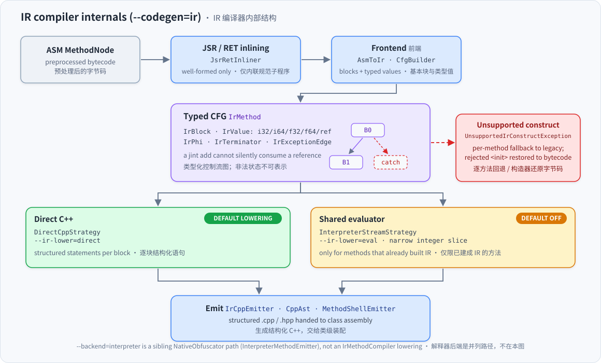

<div align="center">

[English](README.md) | **简体中文**



# native-obfuscator

**把 Java `.class` 转换为配合 JNI 使用的 C++ 代码。**

[](https://github.com/gaoyu06/native-obfuscator/actions/workflows/main.yml)
[](LICENSE)
[](#当前状态)
[](#zig-工具链)
[](https://github.com/radioegor146/native-obfuscator)

</div>

`native-obfuscator` 读取一个 JAR，把选定的方法体转译成通过 `JNIEnv` 复现字节码语义的 JNI C++ 代码，并把这些方法替换为 `native` 桩。运行时由 JVM 调度进生成的共享库。

CLI 默认仍是 **legacy**（基于 snippet 模板的旧生成器）。`master` 上还包含：可选的 typed CFG IR 路径（`--codegen=ir`）、默认关闭的共享求值器降级（`--ir-lower=eval`）、默认关闭的进程内解释器（`--backend=interpreter`）、一个随生成 JAR 打包的小型 C++ SDK、JDK 17+ 语料 harness 以及基准测试 harness。以上**都不是**生产级支持承诺。

> [!IMPORTANT]
> 本工具做的是字节码到本地代码的**转译**。它本身不做二进制加壳，也不能单靠自己隐藏算法特征。请使用黑名单/白名单——把整个应用 JAR（比如游戏客户端）全部转译通常是错误的默认做法。

**关于版本支持的措辞：** Java 8 是本项目唯一称过“完整支持”的版本；9+ 与 Android 仍是实验性的。JDK 17 / 21 / 25 的 IR 语料分别有过 11/11、6/6、4/4 的 stdout 对齐记录，但都只是**一台** Linux 虚拟机上的测量，**不能**写成“已支持 JDK 17/21/25”。现行目标（IR 全覆盖后废弃 legacy）**尚未完成**，默认生成器仍是 `legacy`。

---

## 目录

- [工作原理](#工作原理)
- [当前状态](#当前状态)
- [代码生成模式](#代码生成模式)
- [快速上手](#快速上手)
- [前置条件](#前置条件)
- [用法](#用法)
  - [参数](#参数)
  - [平台](#平台)
  - [注解](#注解)
  - [基本流程](#基本流程)
  - [JDK 24+ 的 native-access](#jdk-24-的-native-access)
- [Zig 工具链](#zig-工具链)
- [C++ SDK（随生成 JAR）](#c-sdk随生成-jar)
- [仓库结构](#仓库结构)
- [IR 编译器内部](#ir-编译器内部)
- [构建与测试](#构建与测试)
- [文档](#文档)
- [参与贡献](#参与贡献)
- [问题反馈](#问题反馈)

---

## 工作原理



1. **加载与筛选** — `NativeObfuscator.process` 流式读取 JAR，用 ASM 解析为 `ClassNode`，并应用 `ClassMethodFilter`（黑/白名单加 `@Native`/`@NotNative` 注解）。
2. **字节码预处理** — `IndyPreprocessor` 与 `LdcPreprocessor` 降级 `invokedynamic` 及句柄/类型常量；随后用 `COMPUTE_MAXS | COMPUTE_FRAMES` 重新序列化并重读，保证栈帧信息在代码生成前是权威的。
3. **逐方法代码生成** — `NativeObfuscator` 的方法循环是分派点。每个选定方法会进入 legacy snippet 生成器（`MethodProcessor`，默认）、typed CFG IR 路径（`--codegen=ir` 时的 `IrMethodCompiler`），或进程内解释器（`--backend=interpreter` 时的 `InterpreterMethodEmitter`，默认关闭）。`--ir-lower=eval` 是 IR 编译器内部的降级（`InterpreterStreamStrategy`），不是解释器后端。
4. **类级装配** — `ClassSourceBuilder`、`CMakeFilesBuilder`、`MainSourceBuilder` 与 `StringPool` 写出 `cpp/` 目录，并把选定方法改写为 `native` 桩。
5. **运行时辅助** — `native_jvm.{cpp,hpp}` 与 `string_pool.{cpp,hpp}` 随生成源码一起拷贝。
6. **本地编译** — CMake，或加 `--use-zig` 时用 Zig。这是**独立的一步**；默认流程里工具本身不编译二进制。

运行时，loader 类加载共享库，JVM 通过 JNI 把 `native` 桩调度进库里：



更完整的图解见 [`docs/architecture/overview.md`](docs/architecture/overview.md)。

## 当前状态

记录于 `master`，基于 [#118](https://github.com/gaoyu06/native-obfuscator/pull/118)/[#119](https://github.com/gaoyu06/native-obfuscator/pull/119) 以及后续到 [#442](https://github.com/gaoyu06/native-obfuscator/pull/442) 的合入。现行目标见 [`docs/architecture/current-goal.md`](docs/architecture/current-goal.md)，状态细节见 [`docs/architecture/project-status.md`](docs/architecture/project-status.md)。

| 主题 | 实际情况 |
| --- | --- |
| 现行目标 | 把所有方法体代码生成迁到 IR，然后删除 legacy snippet 路径。**尚未完成**。覆盖完整前默认保持 `legacy` |
| 默认生成器 | `legacy`（snippet / `cppsnippets.properties`） |
| 可选 IR | `--codegen=ir` — typed CFG，覆盖到 phase 20，另含 `LCMP`、`IF_ACMP*`、monitor / synchronized、可被预处理器降级的 `invokedynamic`、已验证的 `ConstantDynamic`（类与接口）、原始 MethodHandle / MethodType `LDC`、原始类型 `Class` `LDC`，以及规范 `jsr`/`ret` 内联。遇到不支持的构造时逐方法回退到 legacy |
| 类文件元数据 | 保留输入的 major version（仅设 Java 8 下限）。不再因强制写 52 而抹掉 Nest / record / sealed 属性 |
| Java 基线 | 历史 README 的说法保持不变：**Java 8 是本项目唯一称过完整支持的版本。** 9+ 与 Android 仍是实验性的 |
| JDK 17 IR 语料 | 11 个 `--release 17` 程序在**一台** Linux x86-64 虚拟机上、`--codegen=ir` 下与 HotSpot stdout 对齐。这不是“支持 JDK 17”的产品级徽章 |
| JDK 21 IR 语料 | 局部类型拆分后，6 个 `--release 21` 程序在**一台** Linux 虚拟机上对齐。不等于“支持 JDK 21” |
| JDK 25 IR 语料 | 4 个 `--release 25` 程序在**一台** Linux 虚拟机（Temurin 25.0.4.1+1）上对齐。21 个方法中 20 个走 IR；一个混合构造器留在 Java；每次运行都有 JEP 472 警告。不等于“支持 JDK 25” |
| ClassicTest IR 接纳 | phase-18 语料上 108/108 方法被接纳（接纳 ≠ 行为级端到端验证） |
| Native-access 打包 | 输出 JAR 写入 `Enable-Native-Access: ALL-UNNAMED`（对 `java -jar` 生效）。classpath 启动仍需 `--enable-native-access=ALL-UNNAMED`。不等于“支持 JDK 25” |
| C++ SDK | `NativePrimitives` + `NativeStrings` 打进生成的 JAR。不是独立发布的产品 SDK |
| 解释器 | `--backend=interpreter` 默认关闭（默认 `cpp`）。ISA v4：静态 `int`/`long`、引用，以及首个异常表（`ATHROW`）。无 `NEW`、调用与字段。不是保护类产品 |
| 共享求值器 | `--ir-lower=eval` 默认关闭（默认 `direct`），且只作用于已成功建成 IR 的方法的窄整数切片。未达可交付状态 |
| 阅读者 / 分析门槛 | 未达标。在已记录的评估里，未借助工具的阅读者恢复出了 live IR 与操作码痕迹 |
| 性能 | 最近一次三模式测试：[`docs/benchmarks/results-ir-vs-legacy-phase19.md`](docs/benchmarks/results-ir-vs-legacy-phase19.md)。三个 kernel 在一台虚拟机上都留在了 IR。不可外推为普适加速。优先用白名单 |

## 代码生成模式



各开关对每个选定方法的作用：



`--backend=interpreter` 是另一个独立、默认关闭的开关（默认为 `--backend=cpp`）：一个窄范围的进程内解释器，当前为 ISA v4（静态 `int`/`long`、引用、`ATHROW`/异常表；无 `NEW`、调用与字段）。它不是保护类产品。

## 快速上手



```bash
# 1. 转译（可选加 --codegen=ir）
java -jar native-obfuscator.jar app.jar out/

# 2. 编译生成的 C++（已记录的 IR 构建使用 CC=gcc CXX=g++）
cd out/cpp && cmake . && cmake --build . --config Release

# 3. 把 build/libs/ 下的共享库拷贝到 stdout 打印的装载目录（默认 native0/）

# 4. 运行
java -jar out/app.jar
```

第 2–3 步也可以用内置的 [Zig 工具链](#zig-工具链)（`--use-zig`）代替。

## 前置条件

1. **JDK** — 历史路径 JDK 8 即可。当前的测试/E2E 工作也用过更新的 JDK（例如 21）作为*宿主*编译器。编译生成的 C++ 时仍需要带 `jni.h` 的 JDK。
2. **CMake** — [cmake.org](https://cmake.org/download/) 或发行版软件包。
3. **C/C++ 工具链** — Windows 上 MSVC 或 MinGW；Linux/macOS 上 `g++`。部分环境默认的 Clang 无法链接 `libstdc++`；已记录的 IR E2E 使用 `CC=gcc CXX=g++`。
4. 可选：**Zig**，配合 `--use-zig`（见下文）。
5. 跑完整测试套件时可选：[Krakatau](https://github.com/Storyyeller/Krakatau)（`krak2`）需在 `PATH` 上。

## 用法

```text
Usage: native-obfuscator [-ahV] [--debug] [--codegen=<mode>]
                         [--ir-lower=<lowering>] [--backend=<backend>]
                         [-b=<blackListFile>] [--custom-lib-dir=<dir>]
                         [-l=<librariesDirectory>] [-p=<platform>]
                         [--plain-lib-name=<libraryName>] [-w=<whiteListFile>]
                         [--use-zig] [--zig-targets=<targets>]
                         [--zig-path=<file>] [--jdk-home=<file>]
                         [--zig-install-dir=<dir>]
                         <jarFile> <outputDirectory>
```

### 参数

| 参数 | 含义 |
| --- | --- |
| `<jarFile>` | 输入 JAR |
| `<outputDirectory>` | 输出转换后 JAR 与 `cpp/` 目录的位置 |
| `-l` | 依赖库目录（可选，推荐提供） |
| `-p` | `hotspot`（默认）、`std_java` 或 `android` |
| `--codegen` | `legacy`（默认）或 `ir` |
| `--ir-lower` | `direct`（默认）或 `eval`；仅在 `--codegen=ir` 时才被读取 |
| `--backend` | `cpp`（默认）或 `interpreter`（窄 int/i64/引用切片；默认关闭） |
| `-a` | 启用 `@Native` / `@NotNative` 注解处理 |
| `-w` / `-b` | 白名单 / 黑名单文件 |
| `--plain-lib-name` | 单独分发本地库或用于 Android 时，`LoaderPlain` 使用的库名 |
| `--custom-lib-dir` | JAR 内放置打包库的目录（未覆盖时 stdout 打印默认 `native0/`） |
| `--debug` | 额外写出一个不可执行的调试 JAR |
| `--use-zig` | 用 Zig 编译生成的 C++ 并打包共享库 |
| `--zig-targets` | 逗号分隔的 Zig 目标（默认 `host`） |
| `--zig-path` | Zig 可执行文件（优先于已安装/`PATH`） |
| `--jdk-home` | 带 `include/jni.h` 的 JDK（默认取 `JAVA_HOME`） |
| `--zig-install-dir` | Zig 的安装位置（默认 `~/.native-obfuscator/zig/`） |

`--codegen=ir` 是可选项。其 `direct` 降级保持默认；`--ir-lower=eval` 选择窄范围的共享求值器降级。不支持的方法逐方法回退到 legacy 生成器；例外是被拒绝的 `<init>` 方法体，它们会恢复为原始字节码（含 `invokedynamic`），而不是留下内部预处理器标记。`--backend=interpreter` 是另一个独立可选项，默认关闭。

### 平台

- `hotspot` — 使用 HotSpot 内部机制；与许多现有混淆器兼容，包括部分栈回溯检查。
- `std_java` — 更少依赖 JVM 内部；目标是跨 JVM 更可移植。
- `android` — 隐藏方法没有 `DefineClass`。依赖这些隐藏方法的基于栈的字符串/名称方案将不可用。

### 注解

Maven 坐标：`com.github.radioegor146.native-obfuscator:annotations:master-SNAPSHOT`（需添加 [JitPack](https://jitpack.io)）。

- `@Native` — 包含该类或方法
- `@NotNative` — 跳过 `@Native` 类中的某个方法

白名单/黑名单优先于注解。

格式：

```text
<class>
<class>#<method name>#<method descriptor>
mypackage/myotherpackage/Class1
mypackage/myotherpackage/Class1#doSomething!()V
mypackage/myotherpackage/Class1$SubClass#doOther!(I)V
```

通配符：`*` 匹配一个以 `/` 分隔的段；`**` 匹配剩余所有段。

### 基本流程

1. `java -jar native-obfuscator.jar <input.jar> <output-dir>`
2. 可选 IR：加 `--codegen=ir`（还可加 `--ir-lower=eval`）
3. 在生成的 `cpp/` 目录里执行 `cmake .`（已记录的 IR 构建使用 `CC=gcc CXX=g++`）
4. `cmake --build . --config Release`
5. 把 `build/libs/` 下的共享库拷贝到 stdout 打印的装载路径（默认 `native0/`），命名形如：

   ```text
   x64-windows.dll
   x64-linux.so
   x86-windows.dll
   x64-macos.dylib
   arm64-linux.so
   arm64-windows.dll
   ```

6. `java -jar <output.jar>`

如果希望在把库拷入装载目录后将其打包进 JAR，不要传 `--plain-lib-name`。

### JDK 24+ 的 native-access

loader 类会调用 `System.load`/`System.loadLibrary`，而 [JEP 472](https://openjdk.org/jeps/472) 把它们列为受限操作。JDK 24+ 上未启用时默认告警，未来版本可能改为报错。输出 JAR 的 `META-INF/MANIFEST.MF` 会写入 `Enable-Native-Access: ALL-UNNAMED`，因此 `java -jar <output.jar>` 启动时无名模块无需额外参数即可获得 native 访问（输入 manifest 里已有的更具体取值会被保留）。classpath 启动不认这个 manifest 属性，仍需显式加参数：

```text
java --enable-native-access=ALL-UNNAMED -cp <output.jar> <main-class>
```

这只是打包上的便利，不代表“支持 JDK 25”。

## Zig 工具链

第 2–5 步可以用 `--use-zig` 代替（不需要 CMake / 宿主编译器；自带交叉编译）。

```text
java -jar native-obfuscator.jar install-zig [--version <x.y.z>] [--install-dir <path>] [--force]
```

下载官方 Zig 发行版（SHA-256 校验），默认装到 `~/.native-obfuscator/zig/`。

```text
java -jar native-obfuscator.jar --use-zig \
     [--zig-targets x64-windows,x64-linux,arm64-linux] \
     [--jdk-home <path-to-jdk>] \
     <input.jar> <output-dir>
```

已知目标包括 `x64-linux`、`x64-windows`、`x64-macos`、`arm64-linux`、`arm64-windows`、`arm64-macos`、`x86-linux`、`x86-windows`、`arm32-linux` 与 `host`。

## C++ SDK（随生成 JAR）

生成的 JAR 可以包含 `by.radioegor146.sdk.NativePrimitives` 与 `NativeStrings`。这**不是**独立发版的产品 SDK。

Primitives（见 [`docs/sdk/v1-status.md`](docs/sdk/v1-status.md)）：

- `abiVersion()`
- `sha256(byte[])`
- `hmacSha256(byte[] key, byte[] message)`
- `aes256GcmEncrypt` / `aes256GcmDecrypt`（32 字节 key、12 字节 nonce、16 字节 tag；同一 key 不要复用 nonce）
- `constantTimeEquals(byte[], byte[])`

Strings：与 Java 兼容的 UTF-16 `length`、`hashCode` 与 `concat`。已记录的字符串基准**慢于 HotSpot**。

## 仓库结构



| 路径 | 作用 |
| --- | --- |
| `obfuscator/` | CLI 与转译器本体（`by.radioegor146.*`、`ir/`、`interpreter/`、`zig/`、运行时源码） |
| `annotations/` | `@Native` / `@NotNative`，可经 JitPack 使用 |
| `sdk/` | `NativePrimitives` / `NativeStrings`，打进生成的 JAR |
| `docs/` | 状态、设计、基准与审查文档——从 [`docs/README.md`](docs/README.md) 开始读 |

## IR 编译器内部



可选的 `--codegen=ir` 路径从预处理后的 ASM 树构建类型化控制流图（值类型为 `i32`/`i64`/`f32`/`f64`/引用；`AsmToIr`、`CfgBuilder`，规范的 `jsr`/`ret` 先内联），经策略降级（默认 `DirectCppStrategy`，`--ir-lower=eval` 时为 `InterpreterStreamStrategy`），再由 `IrCppEmitter` 生成结构化 C++。`--backend=interpreter` 是 `NativeObfuscator` 上的并列路径（`InterpreterMethodEmitter`），不是 IR 编译器的降级。遇到不支持的构造会抛出 `UnsupportedIrConstructException` 并逐方法回退到 legacy 生成器；被拒绝的 `<init>` 方法体恢复为原始字节码。

设计与状态：[`docs/architecture/ir-compiler.md`](docs/architecture/ir-compiler.md) ·
[`docs/architecture/current-goal.md`](docs/architecture/current-goal.md) ·
[`docs/architecture/project-status.md`](docs/architecture/project-status.md)。

## 构建与测试

```text
./gradlew assemble          # 跳过测试
./gradlew build             # assemble + 完整套件（部分用例需要 krak2）
```

集成期间使用的聚焦 IR 套件：

```text
CC=gcc CXX=g++ ./gradlew :obfuscator:test \
  --tests by.radioegor146.ir.IrCompilerTest \
  --tests by.radioegor146.CodegenModeTest
```

ClassicTest 风格的语料在 `obfuscator/test_data/` 下，部分来自 [huzpsb/JavaObfuscatorTest](https://github.com/huzpsb/JavaObfuscatorTest)。

CI 是名为 “Main pipeline” 的工作流（[`.github/workflows/main.yml`](.github/workflows/main.yml)），在 JDK 8/11/17/21/25 × Ubuntu/macOS/Windows 上运行。

## 文档

从 [`docs/README.md`](docs/README.md) 开始。

| 文档 | 作用 |
| --- | --- |
| [架构总览](docs/architecture/overview.md) | 流水线的图解页（双语） |
| [现行目标](docs/architecture/current-goal.md) | 现行目标：IR 覆盖完整后废弃 legacy |
| [项目状态](docs/architecture/project-status.md) | master 上有什么、没有什么、不许声称什么 |
| [IR 编译器](docs/architecture/ir-compiler.md) | typed CFG 设计 |
| [IR phase 18](docs/architecture/ir-phase18-status.md) | 原始类型数组与 `MULTIANEWARRAY` |
| [JDK 17 IR 运行时修复](docs/architecture/ir-jdk17-runtime-fix.md) | 版本 / indy / `invokeExact` |
| [SDK v1](docs/sdk/v1-status.md) | Java API 与 C ABI |
| [基准测试](docs/benchmarks/README.md) | 如何运行 harness；不要编造数字 |
| [历史选项简报](docs/architecture/goal-status-and-options.md) | 合入前的维护者快照（作为*现状*已被取代） |

## 参与贡献

见 [`CONTRIBUTING.md`](CONTRIBUTING.md)。简版：先读 [`docs/architecture/current-goal.md`](docs/architecture/current-goal.md)，用真实跑过的测试作为验收门禁，并且不要夸大状态声明。

## 问题反馈

在本仓库开 issue，或联系原作者 [re146.dev](https://re146.dev)。

## 许可证

[GPL-3.0](LICENSE)。

### Star 历史

[](https://starchart.cc/radioegor146/native-obfuscator)
